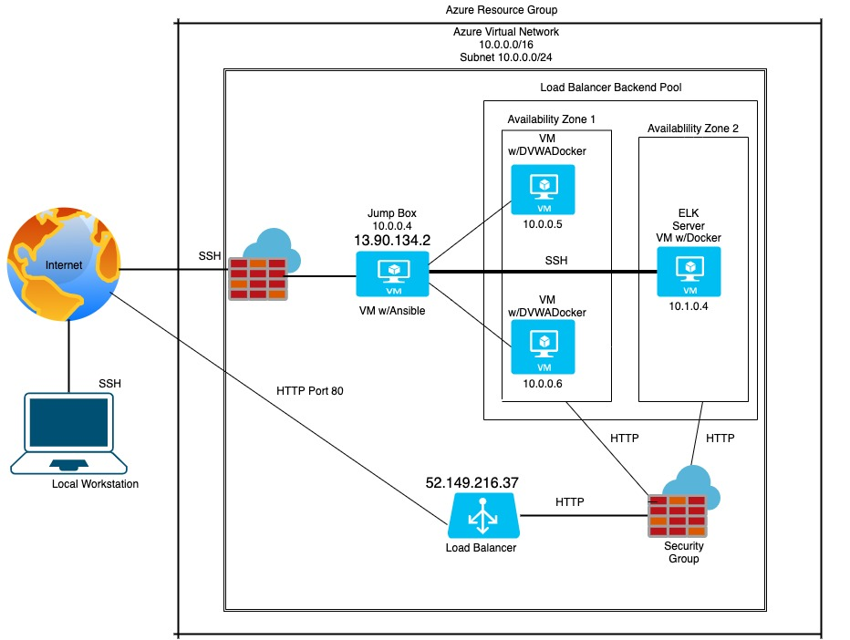

Cloud Network
This is a collection of Linux Scripts and Ansible Scripts from my CyberSecurity Class.
Most of the scripts are used to configure cloud servers with different docker containers.
The Final Setup was 4 servers running vulnerable DVWA containers along with a jump box and a server running an ELK stak container

